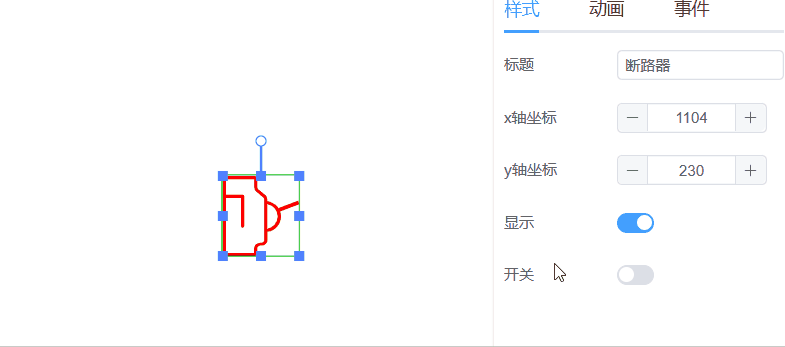
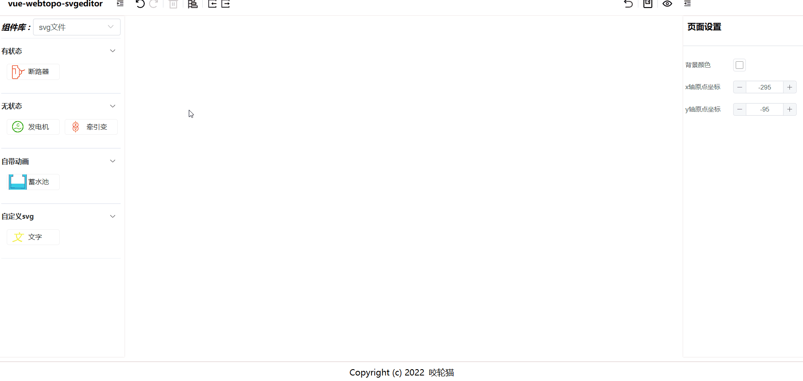
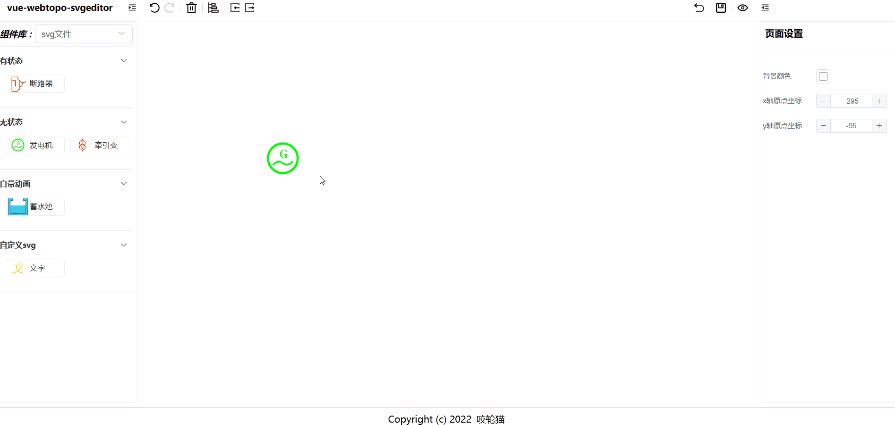
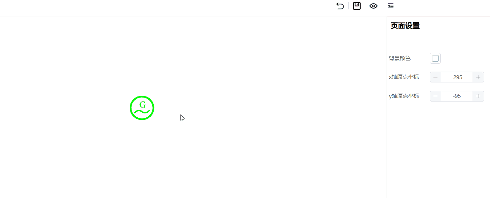

# vue-webtopo-svgeditor

> 基于 vue3.2+ts 实现的 svg 可视化 web 组态编辑器。可直接把 svg 文件和 vue 组件作为编辑器图形库使用，赋予其缩放和旋转等功能，并支持自定义拓展参数，实时控制组件状态等

预览地址：[http://svg.yaolm.top/](http://svg.yaolm.top/)

有问题请提[issue](https://github.com/yaolunmao/vue-webtopo-svgeditor/issues)，以便帮助更多有相同问题的人

历史版本请在本项目其它分支进行查看

## 项目优点

### 组态软件核心功能都具备

没有特殊需求，只需要配置好图形库，即可开始您的组态世界

### 学习成本低

`svg`文件即组件，引入之后无需进行额外配置，编辑器会自适应解析加载组件，添加自定义组件和传统`html`无差，前端 er 零学习成本上手

### 易拓展

配置文件采用开放式结构，属性支持自定义拓展。图形库支持添加`svg`文件或者`vue`组件，定制开发将变得容易

### 易于集成

项目已经编写好了库模式脚本，组件已经发布到[npm](https://www.npmjs.com/package/webtopo-svg-edit)，支持外部传入自定义组件，支持组件事件订阅等

### 免费开源

MIT 开源协议 可商用（自带的`svg`文件除外）

## 图形库说明

### 无状态组件

无状态组件就是`svg`文件，编辑器已经将节点的拖动，缩放，旋转等功能封装好了，您无需做出额外配置即可使用，若是需要动态的去设置`svg`的颜色边框之类的，需要自行设置`props`，参考`src\config-center\svg-file\stateless`的配置，可以设置的属性为`svg`的公共属性，例如`fill`、`stroke `、`stroke-dasharray`这些，具体属性请参考[MDN-SVG 属性](https://developer.mozilla.org/zh-CN/docs/Web/SVG/Attribute#svg_%E5%B1%9E%E6%80%A7%EF%BC%88%E6%8C%89%E7%B1%BB%E5%88%AB%E5%88%86%E7%B1%BB%EF%BC%89)

### 有状态组件

有状态组件也是 svg 文件，区别就在于无状态组件控制节点属性的配置配置在`props`上，而有状态组件的配置需要配置到`state`上，有状态组件对比无状态组件的好处是可以改变一个状态去影响多个属性，例如这里的断路器开关，其实是同时改变了颜色和把手的透明度,参考配置：`src\config-center\svg-file\stateful\circuit-breaker\index.ts`



### 自带动画组件

没什么好说的了，支持直接使用自带动画的`svg`文件，参考`src\config-center\svg-file\have-animation`

### 自定义 svg

本质上就是`vue`的`template`代码片段，它可以完全替代无状态组件和有状态组件，并且可以根据自定义代码实现更多节点和属性的控制，缺点就是需要写代码--！参考`src\config-center\svg-file\custom-svg`

### vue 组件

其实和自定义`svg`相似，都是`vue`的`template`代码片段，但是`svg`标签里面无法渲染`html`的代码，所以在最外层用了`foreignObject`进行了包裹，同样支持缩放旋转等操作。参考`src\config-center\vue`

## 如何添加图形库

1. 将下载好的svg文件放到`src\assets\svgs`目录下
2. 修改下载好的svg文件代码片段，删除想动态修改的属性。例如你想动态修改svg的填充颜色，要删掉代码片段的`fill`属性
3. 添加配置文件，文件目录为`src\config-center`

需要注意配置文件的`name`属性要和`svg`文件名保持一致，如果是自定义组件需要按需导入一下，参考`src\config-center\index.ts`，这么做的目的是当你把编辑器构建成插件引入到其它项目的时候，其它项目使用编辑器无需注册你的自定义组件

## 操作说明

### 绘画

选中左侧的组件库，按住鼠标左键即可把组件拖动到画布中



## 操作

选中绘制好的节点后会出现锚点，可以直接进行移动、缩放、旋转等功能，右侧属性面板可以设置配置好的节点的属性，鼠标右键可以进行一些快捷操作



### 连线

鼠标移动到组件上时会出现连线锚点，左键点击锚点创建线段，继续左键点击画布会连续创建线段，右键停止创建线段，鼠标放在线段上会出现线段端点提示，拖动即可重新设置连线，选中线段后还可以在右侧的动画面板设置线段的动画效果



## 其他说明

- 若是组件中心点不是鼠标指针点，请自行在页面设置里匹配`x`轴和`y`轴数据
- 组件隐藏后，可以在顶部工具栏的组件树里面选中隐藏的组件，进而设置隐藏组件的属性
- 本项目示例`svg`文件规格以标准图标大小`1024x1024px`，如果您的组件效果不好，请使用该规格

## 集成到已有项目

### 脚手架项目

```
# 创建项目(已有项目跳过此步骤)
npm init vite@latest

# 进入项目目录
cd projectname

# 安装插件
pnpm i webtopo-svg-edit

# 安装pinia
pnpm i pinia

# 修改main.ts 注册pinia
import { createPinia } from 'pinia';
const app = createApp(App);
app.use(createPinia());
app.mount('#app')

#在需要的页面引入插件
import { WebtopoSvgEdit,WebtopoSvgPreview } from 'webtopo-svg-edit';
import 'webtopo-svg-edit/dist/style.css'
```
### umd方式集成
```html
<!DOCTYPE html>
<html>
  <head>
    <title>webtopo-svg-edit Example</title>
    <link href="https://unpkg.com/webtopo-svg-edit@0.0.8/dist/style.css" rel="stylesheet" />
    <script src="https://unpkg.com/vue@3.2.6/dist/vue.global.prod.js"></script>
    <script src="https://unpkg.com/vue-demi@0.13.11/lib/index.iife.js"></script>
    <script src="https://unpkg.com/pinia@2.0.33/dist/pinia.iife.prod.js"></script>
    <script src="https://unpkg.com/webtopo-svg-edit@0.0.8/dist/webtopo-svg-edit.umd.js"></script>
  </head>
  <body>
    <div id="app"></div>
    <script>
      const pinia = Pinia.createPinia()
      const app = Vue.createApp(WebtopoYLM.WebtopoSvgEdit)
      app.use(pinia)
      app.mount('#app')
    </script>
  </body>
</html>

```
### es module方式集成
```html
<!DOCTYPE html>
<html>
  <head>
    <title>webtopo-svg-edit Example</title>
    <link href="https://unpkg.com/webtopo-svg-edit@0.0.8/dist/style.css" rel="stylesheet" />
  </head>
  <body>
    <div id="app"></div>
  </body>
</html>
<script type="importmap">
  {
    "imports": {
      "vue": "https://unpkg.com/vue@3.2.47/dist/vue.esm-browser.prod.js",
      "@vue/devtools-api": "https://cdn.jsdelivr.net/npm/@vue/devtools-api/lib/esm/index.min.js",
      "vue-demi": "https://unpkg.com/vue-demi@0.13.11/lib/index.mjs",
      "pinia": "https://unpkg.com/pinia@2.0.29/dist/pinia.esm-browser.js",
      "WebtopoYLM": "https://unpkg.com/webtopo-svg-edit@0.0.8/dist/webtopo-svg-edit.es.js"
    }
  }
</script>
<script type="module">
  import { createApp } from 'vue'
  import { createPinia } from 'pinia'
  import { WebtopoSvgEdit } from 'WebtopoYLM'
  const app = createApp(WebtopoSvgEdit)
  app.use(createPinia())
  app.mount('#app')
</script>

```
如果集成有问题请参考示例项目[demo](/demo)

**请注意：插件方式引入会导致左侧工具栏的 icon 图标无法正确显示，请自行寻找您项目构建工具的 svg 加载器，将 icon 图标转换成 symbol，并将名字命名为‘svg-xxx’即可正常显示**

## 贡献代码

1. `Fork` 本项目
2. 新建`Feat_xxx`分支
3. 提交代码
4. 新建 `Pull Request`

**只接受 github 的 pr，gitee 为 github 镜像库**

## 声明

**本项目组件库来源均为网络，仅供学习交流使用，请勿将本项目里面的组件用于商业用途**

## 常见问题

### vue2怎么集成，有vue2的版本吗？

vue2建议使用iframe、cdn集成，目前没有vue2的版本，如果您接受不了vue2方式集成，也可参考2.1分支进行改造。
### 项目启动不起来怎么办？
请使用`pnpm`安装依赖
### 随便改哪里的代码eslint都报错怎么办？
vscode安装eslint插件
## 鸣谢

吉林省格尺科技有限公司促进该项目诞生

[秀英童鞋](https://blog.csdn.net/qq_42862247)对此项目前进的耐心指导

[一个低代码（可视化拖拽）教学项目](https://github.com/woai3c/visual-drag-demo)

还在坚持用原生`svg`进行组态的开发者们


## 感谢以下小伙伴为此项目做出的贡献

<a href="https://github.com/yaolunmao/vue-webtopo-svgeditor/graphs/contributors"></a>
